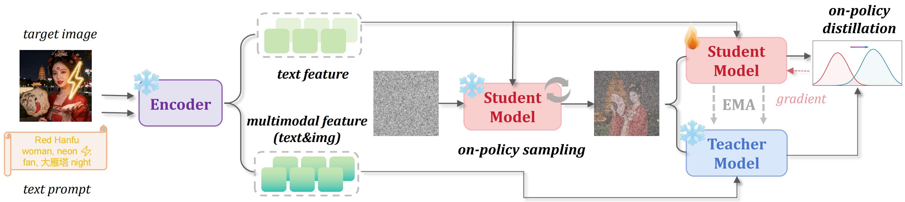
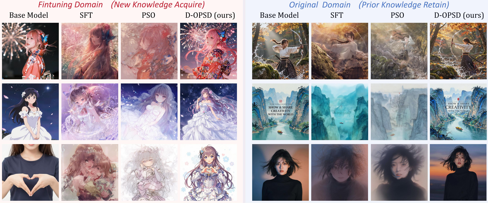
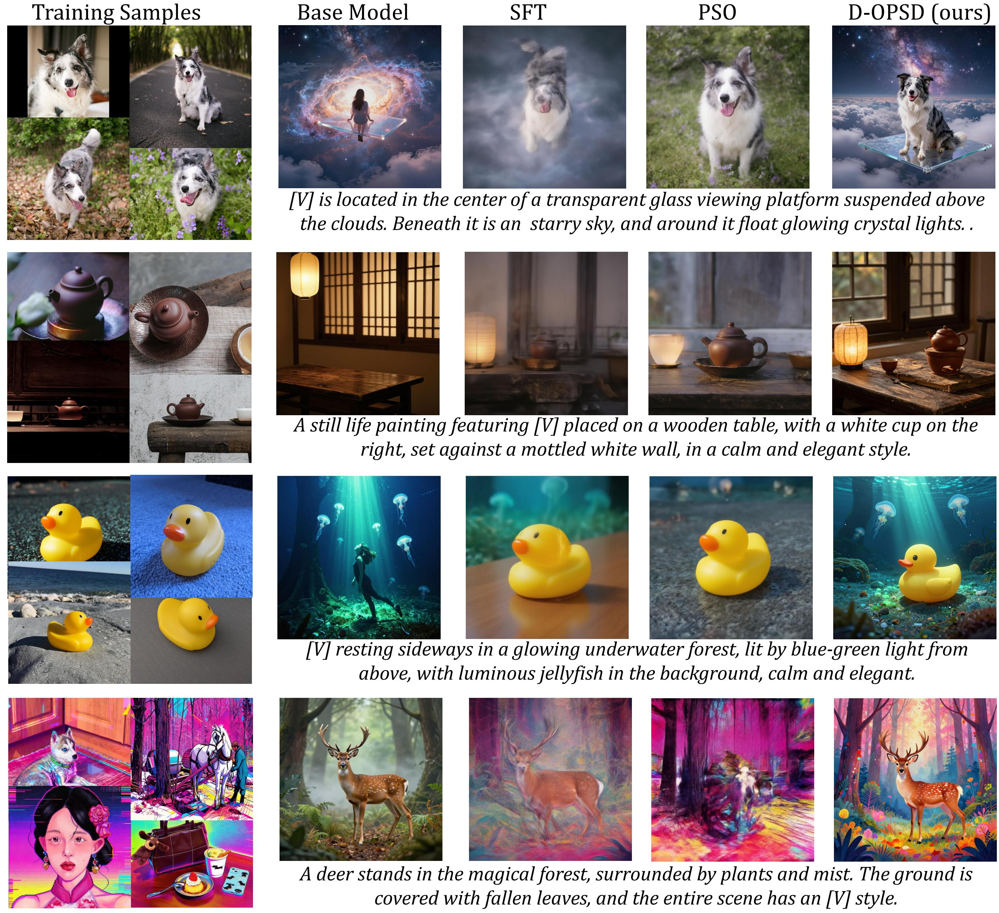

<h1 align="center">D-OPSD<br><sub><sup>On-Policy Self-Distillation for Continuously Tuning Step-Distilled Diffusion Models</sup></sub></h1>

<div align="center">

[](https://vvvvvjdy.github.io/d-opsd/)&#160;
  <a href="https://github.com/vvvvvjdy/D-OPSD"></a> &nbsp;
    <a href="https://github.com/Tongyi-MAI/Z-Image"></a> &nbsp;
<a href="https://arxiv.org/abs/2605.05204" target="_blank"></a>

</div>

<p align="center">
  
</p>

### 🛕 Environment Setup
```bash
git clone https://github.com/vvvvvjdy/D-OPSD.git
conda create -n dopsd python=3.12 -y
conda activate dopsd
pip install -r requirements.txt
```
****


### 🍬 Training 

#### D-OPSD Z-Image-Turbo LoRA training with self-distilled vlm context:

Refer to [ (z-image-turbo_self-distill-vlm)](z-image-turbo_self-distill-vlm/README.md) for training guidance.

#### D-OPSD FLUX2-klein LoRA training with self-distilled eidting branch context for scenario of high id accuracy requirement:

Refer to [ (flux2-klein_self-distill-edit)](flux2-klein_self-distill-edit/README.md) for training guidance and more discussion.

****


### 🎀 Highlight

D-OPSD is an on-policy self-distillation training framework for diffusion models especially timestep-distilled ones. It features in:

- D-OPSD identify an emergent property of modern text to image diffusion models with
LLM/VLM encoders and utilize this property to the continuous tuning of step-distilled
diffusion model.
- D-OPSD is a novel diffusion models on-policy self-distillation framework. By
assigning the same model two roles with different contexts, D-OPSD enables supervised
tuning on the student’s own roll-outs without requiring any external reward function or
extra modules.
- D-OPSD is validated in different settings. The results show that our method enables
the model to learn new concepts, styles, and domain preferences while preserving its
original few-step inference capability and previous knowledge.


---


<p align="center">
   <figcaption style="text-align: center; margin-top: 10px; font-size: 0.92em;">
           In full fine-tuning, D-OPSD adapts the model toward the target domain (anime) while retaining original-domain knowledge and few-step inference capability.
        </figcaption>
  
</p>

---


<p align="center">
   <figcaption style="text-align: center; margin-top: 10px; font-size: 0.92em;">
           In small customized LoRA training, D-OPSD learns new concepts from only a few image-text pairs while maintaining few-step generation quality and generalizing to unseen prompts.
        </figcaption>
  
</p>

---


### 🌺 Citation
If you find D-OPSD useful, please kindly cite our paper:
```bibtex
@article{jiang2026dopsd,
      title={D-OPSD: On-Policy Self-Distillation for Continuously Tuning Step-Distilled Diffusion Models},
      author={Jiang, Dengyang and Jin, Xin and Liu, Dongyang and Wang, Zanyi and Zheng, Mingzhe and Du, Ruoyi and Yang, Xiangpeng and Wu, Qilong and Li, Zhen and Gao, Peng and Yang, Harry and Hoi, Steven},
      journal={arXiv preprint arXiv:2605.05204},
      year={2026}
}
```
