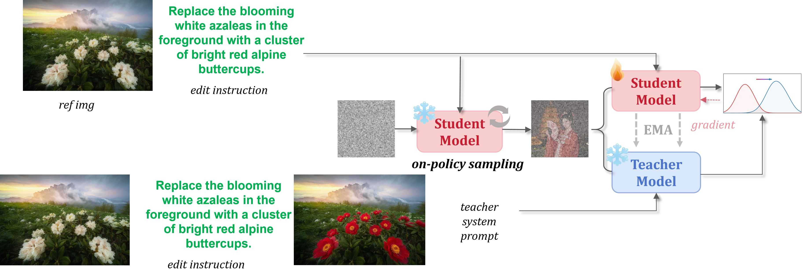
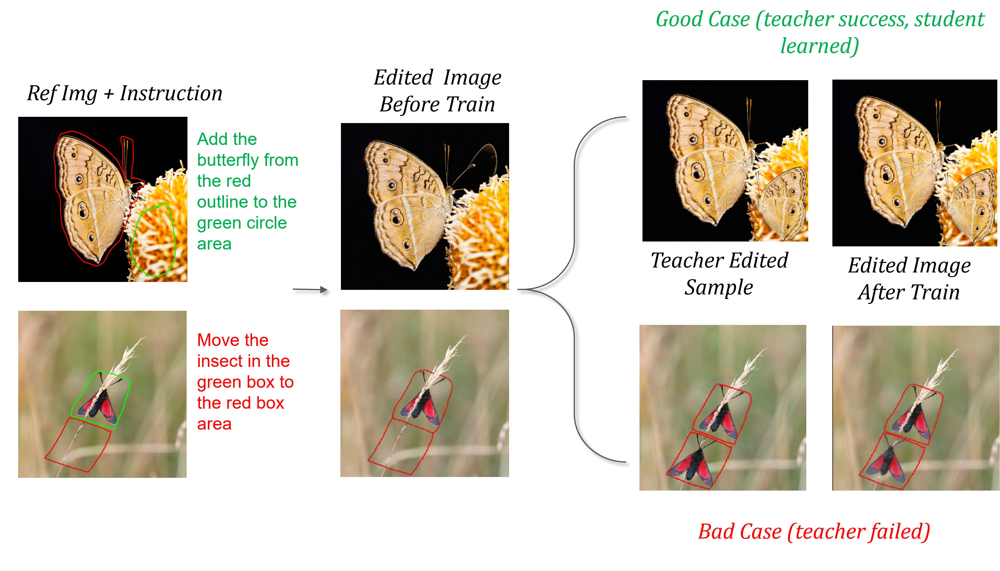

# FLUX2-klein Tuning with D-OPSD (image eidting)

##  🔔  Discussion

---

<p align="center">
   <figcaption style="text-align: center; margin-top: 10px; font-size: 0.94em;">
        </figcaption>
  
</p>

D-OPSD can be naturally adapted to image editing tasks as well. 
Since current SOTA open-source image editing models generally support multi-reference 
image editing, one simple strategy is to include the ground-truth image as one of the reference images in the context, while specifying in the prompt that the last image is the target the model is expected to generate (our specific implementation is illustrated in the figure above). The results are shown below. As discussed in our paper, the performance of this approach is ultimately limited by the capability of the teacher model.

However, it is worth noting that there remain many possible ways to construct the teacher model. 
In our current study, we adopt only a simple reference-image-level concatenation strategy, 
yet this already verifies that D-OPSD does not compromise the few-step capability of the image editing model. 
We hope this finding can inspire the community to explore more effective ways of constructing teacher context.

<p align="center">
   <figcaption style="text-align: center; margin-top: 10px; font-size: 0.92em;">
        </figcaption>
  
</p>


---

##  🌀  Training


#### Single Node 8 GPUs (The specific path settings inside need to be changed.)

Regarding the data, we currently provide 16 interactive editing examples which involving visual prompts, which can be readily replaced with other data sources of the users.
```bash
cd flux2-klein-edit_self-distill-gt-ref
bash scripts/train_lora_4b.sh
#bash scripts/train_lora_9b.sh (Flux2-Klein-9B training)
```


The output directory structure will be like:
```output_dir/
├── checkpoints/
│   │   └── lora_gen_step_i/
├──  samples_trajectory/
│   │   └──t0/
│   │   └──ti/
├── loss_logs/
│   │   └── loss_gen_log.jsonl
├── samples/
│   │   └── samples_original.png
│   │   └── samples_step_i_student.png
│   │   └── samples_step_i_teacher.png
├── args.json
└── log.txt
```

##  🌠 Inference

After training, loading the trained LoRA weights to perform inference. The inference pipeline is the same as the original Flux2-Klein.


## 🤝🏻 Acknowledgement

This code is mainly built upon [DMDR](https://github.com/vvvvvjdy/dmdr/), [Flux2](https://github.com/black-forest-labs/flux2) repositories. 
Thanks for  their contributions to the community.


#

