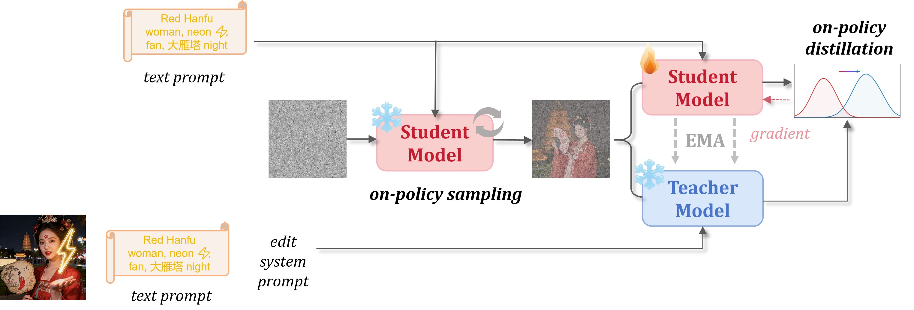
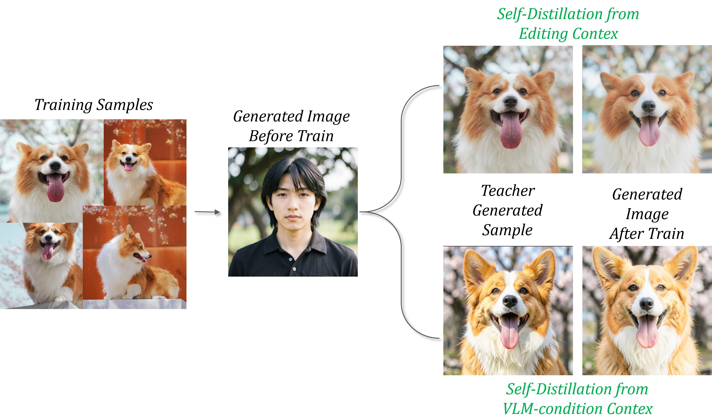

# FLUX2-klein Tuning with D-OPSD (eidting branch context)

##  🔔  Discussion

---

<p align="center">
   <figcaption style="text-align: center; margin-top: 10px; font-size: 0.94em;">
        </figcaption>
  
</p>


In D-OPSD, our view of the key to preserving few-step performance is that the alignment target should come from the same few-step distribution, while the input states should be generated from the model’s own rollouts. 

For omini models such as Flux2-Klein, the construction of teacher context can be considerably more diverse and creative. In our former experiments, we found that although using VLM features as strong context is effective, it often falls short 
in scenarios where extremely high identity fidelity is required. Therefore, based on feedback from the community contributor [Zizhou](https://github.com/ultranationalism), we adopt the Editing branch as the teacher, while keeping the training procedure within the 
same D-OPSD framework. The overall pipeline is illustrated above, and the training results are shown below. As can be observed, this training strategy is more effective at preserving identity consistency.


<p align="center">
   <figcaption style="text-align: center; margin-top: 10px; font-size: 0.92em;">
        </figcaption>
  
</p>


---

##  🌀  Training


#### Single Node 4 GPUs (The specific path settings inside need to be changed.)
```bash
cd flux2-klein_self-distill-edit
bash scripts/train_lora_4b.sh
#bash scripts/train_lora_9b.sh (Flux2-Klein-9B training)
```


The output directory structure will be like:
```output_dir/
├── checkpoints/
│   │   └── lora_gen_step_i/
├──  samples_trajectory/
│   │   └──t0/
│   │   └──ti/
├── loss_logs/
│   │   └── loss_gen_log.jsonl
├── samples/
│   │   └── samples_original.png
│   │   └── samples_step_i_student.png
│   │   └── samples_step_i_teacher.png
├── args.json
└── log.txt
```

##  🌠 Inference

After training, loading the trained LoRA weights to perform inference. The inference pipeline is the same as the original Flux2-Klein.

demo code
```python
import torch
from diffusers import Flux2KleinPipeline
from peft import PeftModel

# 1. Load the pipeline
# Use bfloat16 for optimal performance on supported GPUs
pipe = Flux2KleinPipeline.from_pretrained(
    "black-forest-labs/FLUX.2-klein-4B",
    torch_dtype=torch.bfloat16,
)
pipe.to("cuda")

# 2. Load the LoRA weights
lora_weights_path = "exp_results/dopsd_editcontext_ema0.9999_onpolicy_4steptrain_4b_corgi_bsz4_lora_lr2e-5/lora_gen_step_i/student"
pipe.transformer = PeftModel.from_pretrained(
        pipe.transformer,
        lora_weights_path,
        torch_dtype=torch.bfloat16,
    ).to("cuda")

prompt = """[V] sits on the forest path at dusk, with tall oak trees on both sides, the setting sun casts long shadows on the ground through the leaves. 
The scene is captured with a wide-angle lens, creating a warm and serene atmosphere."""

# 3. Generate Image

# without lora
with pipe.transformer.disable_adapter():
    image_original = pipe(
        prompt=prompt,
        height=1024,
        width=1024,
        num_inference_steps=4,
        guidance_scale=1.0,    
        generator=torch.Generator("cuda").manual_seed(42),
    ).images[0]
# with lora
image_lora = pipe(
    prompt=prompt,
    height=1024,
    width=1024,
    num_inference_steps=4,  
    guidance_scale=1.0,     
    generator=torch.Generator("cuda").manual_seed(42),
).images[0]

#save imgs
image_original.save("samples/samples_original.png")
image_lora.save("samples/samples_step_i_student.png")
```


## 🤝🏻 Acknowledgement

This code is mainly built upon [DMDR](https://github.com/vvvvvjdy/dmdr/), [Flux2](https://github.com/black-forest-labs/flux2) repositories. 
Thanks for  their contributions to the community.

We also want to thank the community contributor [Zizhou](https://github.com/ultranationalism) for the insightful feedback and suggestions on the training strategy.


#

